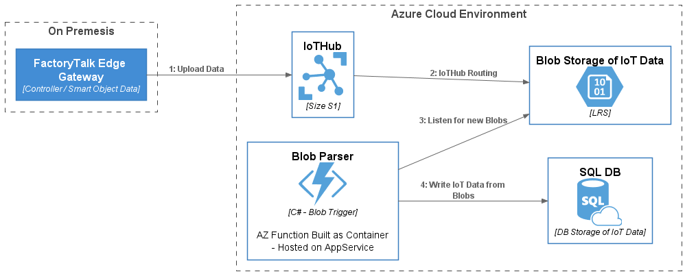

# Blob Parser

## Overview

Azure Function created in Visual Studio 2019 targeting .Net Core (C#).  Function uses a Blob Trigger and then parses the data and inserts the data into a SQL DB.

Data in blob is populated by IoT Hub Routing - data originates from FTEG, giving us a well known data format.

## Solution Architecture



The architecture in this solution was selected to meet the following requirements:

1. All Data received by the IoTHub will be added to long term storage.
2. Add Data received will be made available to clients via interface to well known SQL endpoint.
3. Data in SQL DB will have a variable time to live (hence the need for long term storage).
4. In the future it may be necessary to route this data to other storage and or services.

## Deployment

This repo contains an ARM Template which can be used to deploy this solution.  You can clone the repo and modify the template to meet your needs or simply click the button below to initiate a deployment with the pre-configured values.

[](https://portal.azure.com/#create/Microsoft.Template/uri/https%3A%2F%2Fraw.githubusercontent.com%2FSandlerdev%2FARMTest%2Fmain%2FazureDeploy.json)

## Local Build and Debugging

To run this project locally you will need Visual Studio 2019 or VSCode.  See the following article for more info:
[Develop Azure Functions Using Visual Studio](https://docs.microsoft.com/en-us/azure/azure-functions/functions-develop-vs)

### Connection Strings etc

Local debugging uses a *local.settings.json* file for connection strings etc.  In the published Azure Function these same parameters will be retrieved from the App Settings of the Function Host or App Service.

To prevent "Secrets" from being stored in source control the local.settings.json file has not been included in this repository.   As a result it must be created in the local build environment.

The file should be formatted as shown below and use the keys shown below (key values must be updated)

---

```local.settings.json
{
    "IsEncrypted": false,
    "Values": {
        "AzureWebJobsStorage": "<ConnectionString of Storage Account to store AZ Function MetaData>",
        "storageconnection": "<ConnectionString of Storage Account to watch for IoT Data>",
        "FUNCTIONS_WORKER_RUNTIME": "dotnet"

    },
    "ConnectionStrings": {
        "SQLConnectionString": "<ConnectionString for AzureSQL DB to write the data to.>"
    }
}

```
